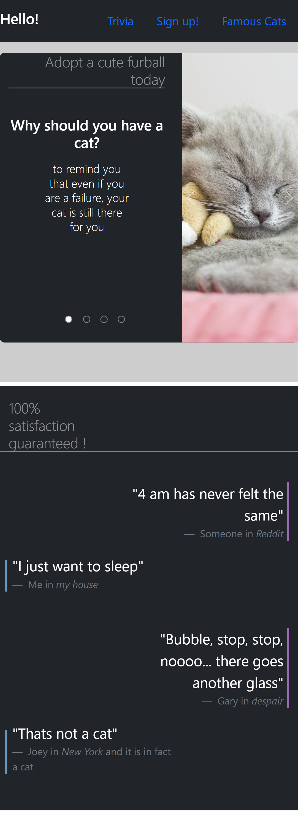

# Week 8 CS50 Assignment - Responsive Website with Bootstrap

## Goals ⚽
Developing a responsive website that utilizes AT LEAST 10 different html and css tags.

Must have 4 pages each of which link to each other

Must Implement at least one of bootstraps feature

No need for a backend

Get more familiarized with making use of frameworks

To see a **live demo of the website**, click [here](https://lugodi.github.io/Homepage/).

## Tecnhologies👩‍💻
- HTML and CSS
- Bootstrap
- Javascript

## Features ✨
- Responsive design that adapts to different screen sizes
- Carousel implemented using Bootstrap to display images and information
- Custom "slideshow" feature that transitions between images automatically
- Trivia quiz with progress bar to track user's progress
- Demo form for practice purposes

## Layout 🎫
Really quick layout just for practice purposes

